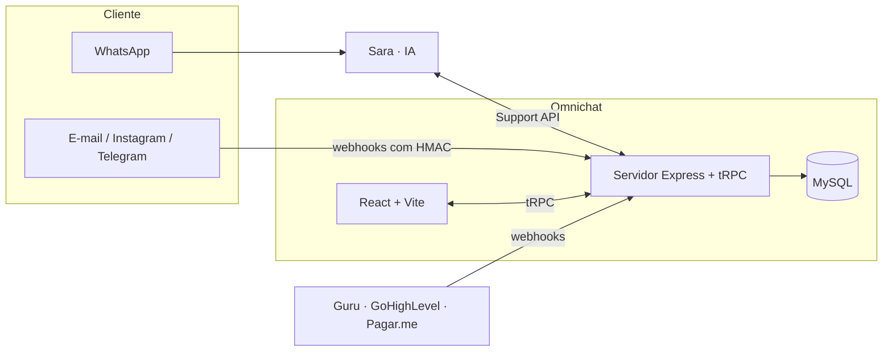

<div align="center">

# Cashmiles · Omnichat-2.0

**Plataforma interna de atendimento do time de Customer Success da Cashmiles.**
Conversas da Sara (IA no WhatsApp) e dos canais próprios numa tela só, com o contexto do cliente ao lado.


</div>

<!-- Sugestão: adicione um print da tela de Conversas em docs/img/conversas.png -->
<!--  -->

---

## Sobre

O Omnichat é uma **ferramenta interna** — não é um produto vendido. Ele junta, numa mesma tela:

- as conversas de WhatsApp atendidas pela **Sara**, a IA de atendimento, com a possibilidade de um atendente **assumir** a conversa a qualquer momento;
- as conversas dos **canais próprios** (e-mail, Instagram, Telegram e WhatsApp legado);
- o **cliente** por trás de cada conversa: cadastro, índice de saúde, MRR, renovação, tarefas e histórico.

A divisão de responsabilidades é simples: **a Sara é dona da conversa; o Cashmiles é dono do cliente.** A ligação entre os dois é o telefone.

## Principais funcionalidades

**Atendimento**
- Tela única de Conversas com abas **Minhas / Não atribuídas / Todas** e filtros por status real (Em Aberto, Aguardando, Grupos) e etiquetas
- Assumir, devolver para a IA e encerrar — com regra de dono checada no servidor: só quem assumiu responde ao cliente
- Faixa de contexto acima do campo de resposta, sempre com a ação que resolve
- Emojis, respostas rápidas (`/`), indicador de "digitando…"
- Notas internas entre atendentes (nunca chegam ao cliente)
- Áudio e imagem recebidos, com descrição gerada pela IA

**Cliente ao lado da conversa**
- Painel em seções recolhíveis: cliente, saúde e financeiro, próximas tarefas, conversas anteriores e notas
- Cadastro do cliente direto pela conversa, com o telefone vindo do servidor
- Conversas anteriores juntando Sara e canais próprios

**Gestão**
- Relatórios, SLA, campanhas, NPS/CSAT, tarefas e jornada do cliente
- Autenticação por e-mail e senha (argon2id), com perfis Admin, Manager e Agent

## Arquitetura



| Camada | Tecnologia |
|---|---|
| Front-end | React 19, Vite 7, Tailwind 4, shadcn/ui |
| API | Node.js + TypeScript, Express, tRPC v11, Zod |
| Banco | MySQL 8 com Drizzle ORM (migrations versionadas) |
| Testes | Vitest |
| Gerenciador | **pnpm** (o `npm install` não funciona neste projeto) |

## Rodando localmente

**Pré-requisitos:** Node.js 20+, pnpm e Docker.

```bash
# 1. Banco
docker run --name mysql-ominichat -e MYSQL_ROOT_PASSWORD=devlocal \
  -e MYSQL_DATABASE=ominichat -p 3306:3306 -d mysql:8
# nas próximas vezes: docker start mysql-ominichat

# 2. Dependências
pnpm install

# 3. Variáveis de ambiente
cp .env.example .env    # e preencha os valores

# 4. Migrations
pnpm db:push

# 5. Primeiro usuário Admin
ADMIN_NAME="Seu Nome" ADMIN_EMAIL=voce@empresa.com ADMIN_PASSWORD=senha-temporaria pnpm create-admin

# 6. Servidor
pnpm dev
```

> O `.env` nunca vai para o Git. Nenhum segredo deve ser colado em issue, PR ou chat.

## Scripts

| Comando | O que faz |
|---|---|
| `pnpm dev` | Servidor de desenvolvimento com recarga automática |
| `pnpm check` | Verificação de tipos (TypeScript) |
| `pnpm test` | Suíte de testes |
| `pnpm build` | Build de produção (também pega erros de CSS que o dev tolera) |
| `pnpm db:push` | Gera e aplica migrations |
| `pnpm create-admin` | Cria um usuário Admin |

## Estrutura

```
client/        front-end (React)
  src/pages/     telas
  src/components/ componentes compartilhados
server/        API (Express + tRPC), webhooks e integrações
shared/        código usado pelo client e pelo server
drizzle/       schema e migrations do banco
docs/          documentação de integrações
scripts/       scripts de desenvolvimento
```

## Como contribuir

1. Atualize a `main`: `git checkout main && git pull`
2. Crie um branch por assunto: `feat/…` ou `fix/…`
3. Commits pequenos e separados por assunto
4. Antes do PR: `pnpm check && pnpm test && pnpm build`
5. Abra o PR descrevendo o que muda, se há migration e o que foi testado
6. Depois do merge, volte ao passo 1

Regras que valem sempre:

- **A Sara está em produção com clientes reais.** Enviar, assumir, devolver e encerrar mexem em conversa de verdade — teste só com contato de teste.
- Nunca registrar telefone, e-mail ou conteúdo de mensagem em log.
- Migration já aplicada não se edita: gere uma nova.
- Cores só pelos tokens do tema, nunca hex solto.

O contexto técnico completo — decisões, armadilhas conhecidas e pendências — está no [`CLAUDE.md`](CLAUDE.md).

## Status

Em desenvolvimento ativo, rodando localmente. Próximos passos: deploy com domínio próprio, webhook de eventos da Sara e gestão do prompt da IA.

---

<div align="center">
<sub>Projeto interno · Cashmiles · Time de Customer Success</sub>
</div>
